## ANR HEAT COFFEE

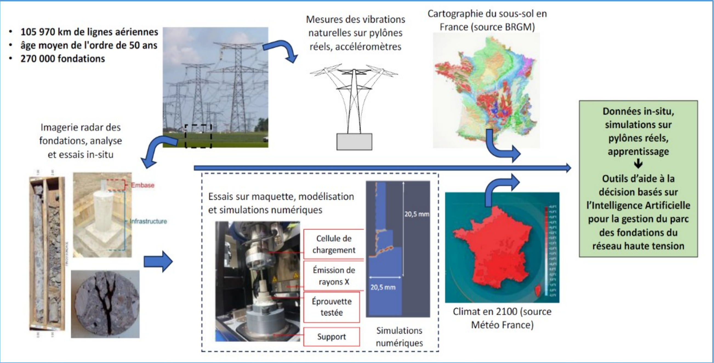{fig-align="center" width="80%" fig-alt="Schéma du projet ANR HEAT COFFEE : 105 970 km de lignes aériennes, âge moyen de l'ordre de 50 ans, 270 000 fondations ; mesures de vibrations sur pylônes réels ; cartographie du sous-sol (BRGM) ; imagerie radar des fondations, analyse et essais in-situ ; essais sur maquette, modélisation et simulations numériques ; climat en 2100 (Météo France) ; outils d'aide à la décision basés sur l'IA pour la gestion du parc des fondations du réseau haute tension."}

## ANR HEAT COFFEE, tâche 2

::: {.box-blue style="text-align:center; font-size:1.3em;"}
**Radar pour l'auscultation de structures de génie civil**
:::

 

::: authors
Franck Daout (SATIE), Philippe Forster (SATIE), Yasaman Momeni (SATIE)\
Tien Anh NGuyen (SATIE), Williams Kouassi (LEME), Eric Vourc'h (SATIE)
:::

  

::: box-orange
**Mission principale**
:::

## Plan 

1. Présentation du contexte de l'ANR HEAT COFFEE - Tache 2
2. Présentation du banc expérimental GPR
3. Démarche expérimentale 
4. Missions secondaires

# Présentation du contexte de l'ANR HEAT COFFEE - Tache 2

## Objectif général

### Problématique :

* Sonder les structures de génie civil et les milieux géotechniques (bétons etc.) sur des profondeurs significatives

* Objectif : estimer les dimensions du milieu sous test, détecter, voire localiser des inhomogénéités

### Solution proposée :

* Système Radar (de type GPR : Ground Penetrating Radar)

## Radar pour l'auscultation de structures de génie civil — Contexte applicatif

::: columns
::: {.column width="45%"}
**Fondation de pylône électrique**

::: {layout-ncol="2"}
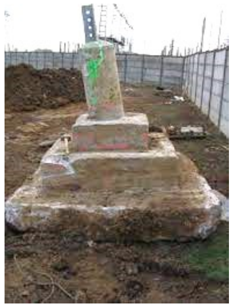{fig-alt="Photo d'une fondation de pylône excavée"}

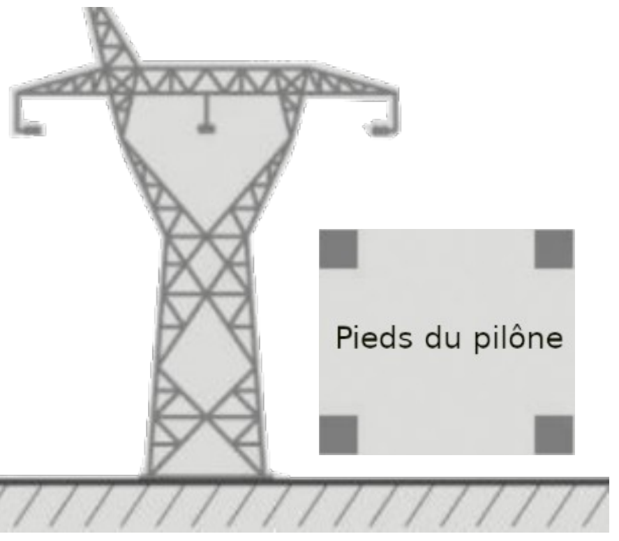{fig-alt="Schéma d'un pylône électrique et de ses quatre pieds"}
:::
:::

::: {.column width="55%"}
::: box-orange
Résolution spatiale souhaitée $\sim 20$ cm
:::

 

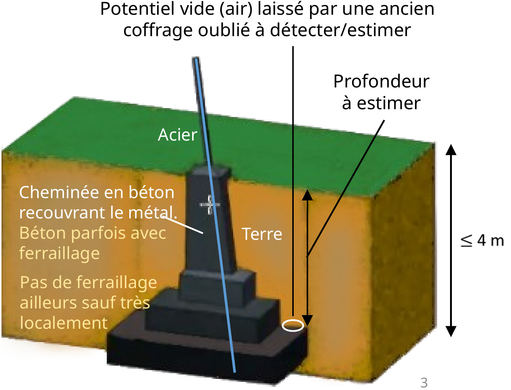{fig-align="center" width="80%" fig-alt="Coupe d'une fondation : cheminée en béton recouvrant le métal (acier), béton parfois avec ferraillage, pas de ferraillage ailleurs sauf très localement, terre, profondeur ≤ 4 m ; potentiel vide (air) laissé par un ancien coffrage oublié à détecter/estimer ; profondeur à estimer."}
:::
:::

## Radar pour l'auscultation de structures de génie civil

::: columns
::: {.column width="52%"}
::: box-blue
**Principe du radar :**
:::

Système GPR (*Ground Penetrating Radar*) en configuration bistatique (émetteur et récepteur séparés)

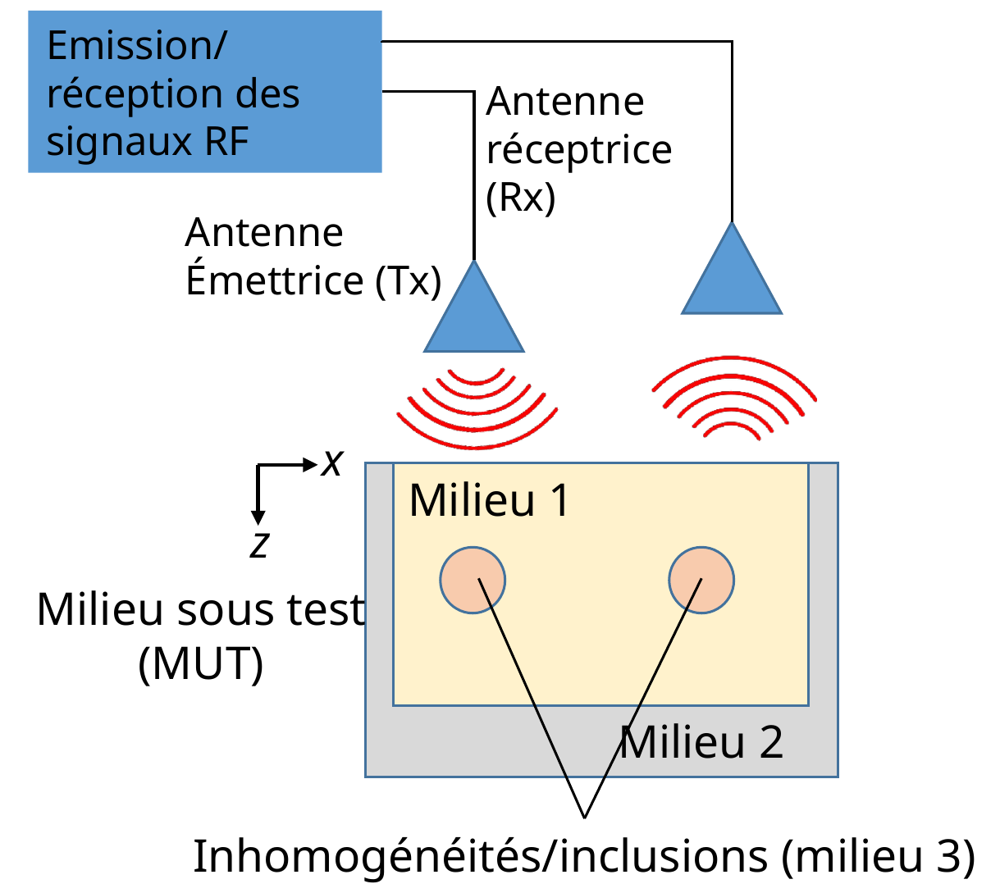{fig-align="center" width=500px
fig-alt="Schéma d'un GPR bistatique : émission/réception des signaux RF, antenne émettrice Tx, antenne réceptrice Rx, milieu sous test (MUT) composé du milieu 1 et du milieu 2, inhomogénéités/inclusions (milieu 3)."}

:::

::: {.column width="48%"}
::: biblio
**Bibliographie sélective sur le GPR pour le génie civil et la géo-physique :**

Spears, M., Hedjazi, S., & Taheri, H. (2023). Ground penetrating radar applications and implementations in civil construction. *Journal of Structural Integrity and Maintenance*, *8*(1), 36-49.

Wang, S., Liu, G., Jing, G., Feng, Q., Liu, H., & Guo, Y. (2022). State-of-the-art review of ground penetrating radar (GPR) applications for railway ballast inspection. *Sensors*, *22*(7), 2450.

Klewe, T., Strangfeld, C., & Kruschwitz, S. (2021). Review of moisture measurements in civil engineering with ground penetrating radar–Applied methods and signal features. *Construction and Building Materials*, *278*, 122250.

Lai, W. W. L., Derobert, X., & Annan, P. (2018). A review of Ground Penetrating Radar application in civil engineering: A 30-year journey from Locating and Testing to Imaging and Diagnosis. *Ndt & E International*, *96*, 58-78.

Economou, N., Benedetto, F., Bano, M., Tzanis, A., Nyquist, J., Sandmeier, K. J., & Cassidy, N. (2017). Advanced ground penetrating radar signal processing techniques. *Signal Processing*, *132*, 197-200.

Venkateswarlu, B., & Tewari, V. C. (2014). Geotechnical applications of ground penetrating radar (GPR). *Jour. Ind. Geol. Cong*, *6*(1), 35-46.

Olhoeft, G. R. (2000). Maximizing the information return from ground penetrating radar. *Journal of Applied Geophysics*, *43*(2-4), 175-187.
:::

 

::: box-orange
[Applications :]{style="text-decoration:underline"} agriculture, analyse des sols (humidité, porosité, biomasse…), archéologie, génie civil…
:::

:::
:::

## Radar pour l'auscultation de structures de génie civil

::: columns
::: {.column width="55%"}
::: box-orange
**L'instrumentation**
:::

-   Choix des fréquences et forme des signaux
-   Topologies possibles du système de capteurs :
    -   Géométrie mono-statique (Tx-Rx = même antenne) ou quasi-monostatique (Tx-Rx = deux antennes proches…)
    -   Géométrie bistatique (Tx et Rx séparés)
    -   Système MIMO (multi Tx et/ou Rx)

::: box-orange
**Le traitement du signal (algorithme…)**
:::

- Faire une image du milieu sous test (MUT) à partir des mesures de signaux RF
:::

::: {.column width="45%"}
 
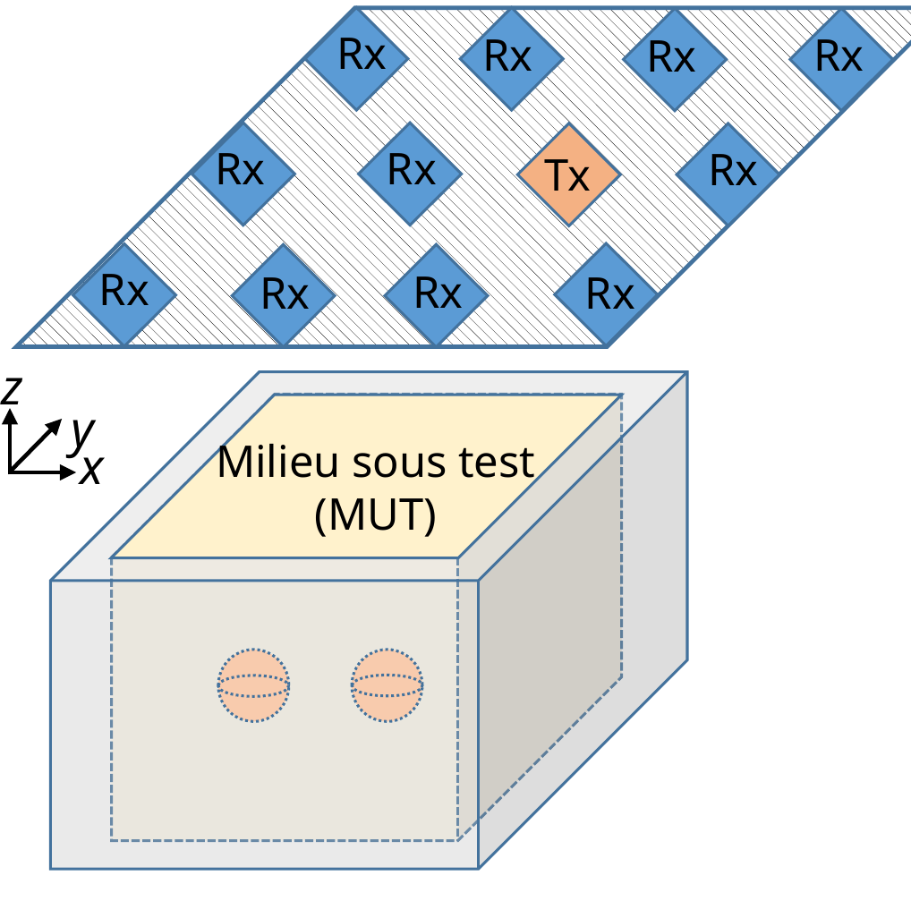{fig-align="center" width=500 fig-alt="Réseau MIMO : un émetteur Tx entouré de plusieurs récepteurs Rx au-dessus du milieu sous test (MUT) contenant deux inclusions sphériques."}
:::
:::

## Radar pour l'auscultation de structures de génie civil

::: box-blue
**Le caractère stratégique du choix des fréquences :** $f \in [100\,\text{MHz}, 20\,\text{GHz}]$
:::

Pour un milieu sous test donné (permittivité diélectrique $\varepsilon_r(f)$) :

-   **Plus $f_0$ (fréq. porteuse) est élevée, plus la portée est faible** (atténuation des signaux…)
-   **Plus $\Delta f$ (bande passante) est large, meilleure est la résolution spatiale**

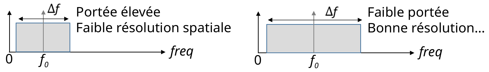{fig-align="center" width="80%" fig-alt="Deux spectres : à gauche bande étroite Δf autour de f0 (portée élevée, faible résolution spatiale) ; à droite bande large Δf (faible portée, bonne résolution)."}

::: box-orange
Compromis $f_0$ & $\Delta f$ à trouver en fonction de l'objectif visé (portée/résolution, détection/imagerie)
:::

## Radar pour l'auscultation de structures de génie civil

::: box-blue
**Des mesures de laboratoire aux mesures de terrain : le choix des fréquences**
:::

::: {style="background:#f2f2f2; padding:.5em .8em; font-size:.75em;"}
[**Approche expérimentale proposée :** utiliser en laboratoire une]{.orange} [maquette à échelle réduite]{style="text-decoration:underline"} et des [fréquences radar plus élevées]{style="text-decoration:underline"}, que l'on dimensionne par [invariance d'échelle par rapport au terrain]{style="text-decoration:underline"} :

$$
d_{max}^{lab} / \lambda_0^{lab} = d_{max}^{terrain} / \lambda_0^{terrain}
\quad\Longleftrightarrow\quad
d_{max}^{lab} \cdot f_0^{lab} = d_{max}^{terrain} \cdot f_0^{terrain}
$$
:::

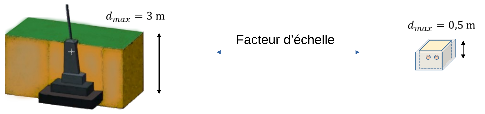{fig-align="center" width="85%" fig-alt="À gauche la fondation de pylône sur le terrain (dmax = 3 m), à droite la maquette de laboratoire (dmax = 0,5 m), reliées par un facteur d'échelle."}

## Radar pour l'auscultation de structures de génie civil

::: box-orange
**Les mesures impulsionnelles**
:::

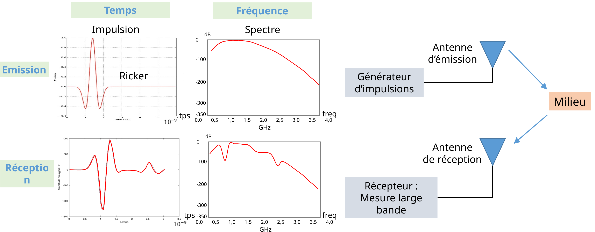{fig-align="center" width="92%" fig-alt="Mesures impulsionnelles : émission d'une impulsion de Ricker (temps) et son spectre (fréquence, 0 à 4 GHz) via un générateur d'impulsions et une antenne d'émission ; réception par une antenne et un récepteur large bande, avec le signal temporel et le spectre reçus après traversée du milieu."}

::: box-green
[Avantages :]{style="text-decoration:underline"} relative simplicité matérielle (de l'émetteur/récepteur)… Rapidité d'acquisition des données.\
[Inconvénients :]{style="text-decoration:underline"} [rapport signal sur bruit (RSB) limité car on émet et reçoit en une fois sur une large bande de fréquence…]{.blue}
:::

## Radar pour l'auscultation de structures de génie civil

::: box-orange
**Les mesures harmoniques (CWSF : *Continuous Wave Step Frequency*)**
:::

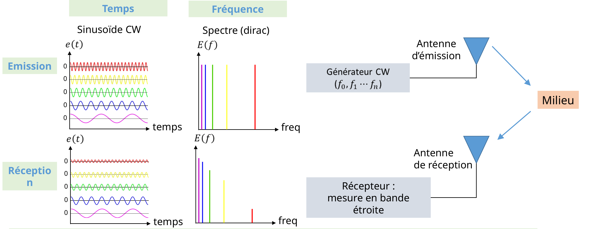{fig-align="center" width="92%" fig-alt="Mesures harmoniques : émission de sinusoïdes CW aux fréquences f0, f1…fn (spectre de diracs) par un générateur CW ; réception en bande étroite des sinusoïdes atténuées après traversée du milieu."}

::: box-green
[Avantages :]{style="text-decoration:underline"} maîtrise des signaux ; matériel de laboratoire (analyseur de réseau vectoriel) ; [bon rapport signal sur bruit (RSB)]{.blue} car [on émet et reçoit fréquence par fréquence]{.blue} (mesure en bande étroite). [Inconvénient :]{style="text-decoration:underline"} durée d'acquisition des signaux…
:::

# Présentation du banc expérimental GPR

## Radar pour l'auscultation de structures de génie civil

::: columns
::: {.column width="50%"}
::: box-blue
**Dispositif expérimental envisagé**
:::
:::
::: {.column width="50%"}
::: box-orange
**Données réelles**
:::
:::
:::

**Émission/réception (via un VNA) des signaux déportée à l'extrémité de câbles RF…**

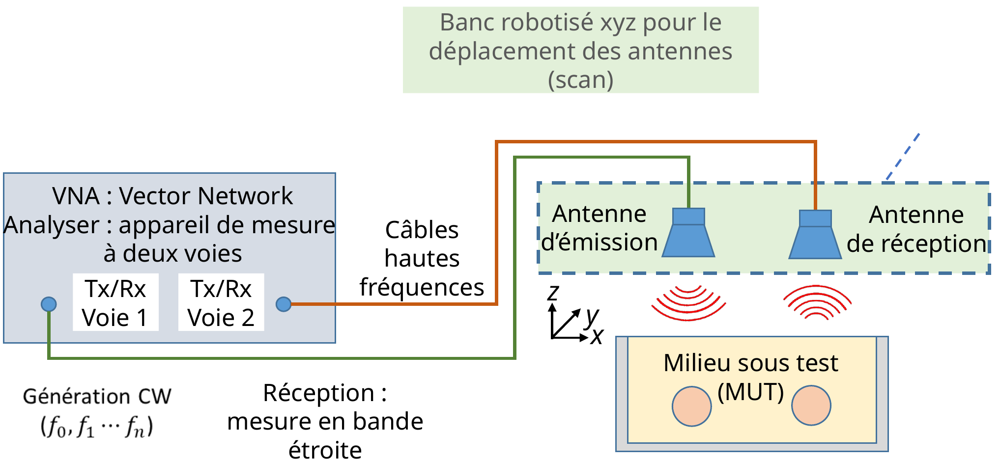{fig-align="center" width="82%" fig-alt="Un analyseur de réseau vectoriel (VNA) à deux voies Tx/Rx génère les signaux CW (f0, f1…fn) vers l'antenne d'émission via des câbles hautes fréquences ; la réception en bande étroite se fait par l'antenne de réception. Un banc robotisé xyz déplace les antennes (scan) au-dessus du milieu sous test (MUT)."}

## Radar pour l'auscultation de structures de génie civil

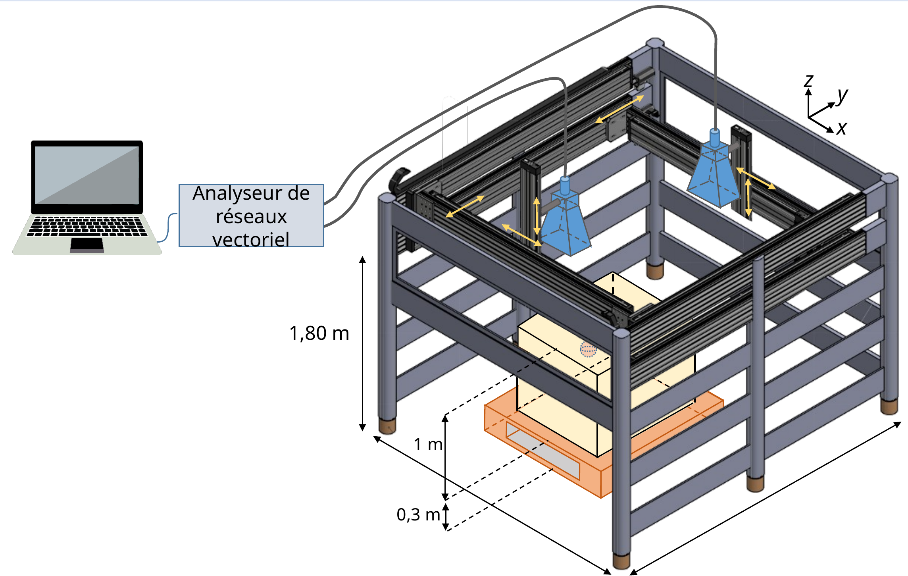{fig-align="center" height="620px" fig-alt="Banc robotisé xyz portant les deux antennes cornets, connecté par câbles à un analyseur de réseaux vectoriel piloté par ordinateur. Dimensions : hauteur 1,80 m ; milieu sous test de 1 m de hauteur posé sur un support de 0,3 m."}

## Radar pour l'auscultation de structures de génie civil

::: box-orange
**Données synthétiques**
:::

::: columns
::: {.column width="48%"}
[Simulations électromagnétiques basées sur la résolution des équations de Maxwell en 3D]{.blue} par une méthode de différences finies dans le domaine temporel (FDTD : *finite difference in time domain*).

Possibilités :

-   Modélisation de géométries complexes.
-   Modélisation fine des sols.
-   Sources d'ondes et antennes variées.
:::

::: {.column width="52%"}
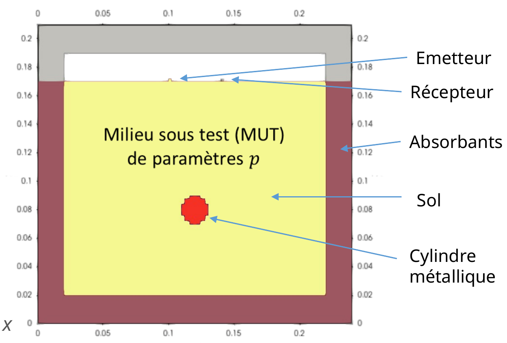{fig-align="center" fig-alt="Géométrie de simulation gprMax : émetteur et récepteur au-dessus du milieu sous test (MUT) de paramètres p, constitué d'un sol contenant un cylindre métallique, entouré d'absorbants."}
:::
:::

## Radar pour l'auscultation de structures de génie civil

::: box-blue
**A scan : Exemple avec gprMax** (post-traité)
:::

::: columns
::: {.column width="38%"}
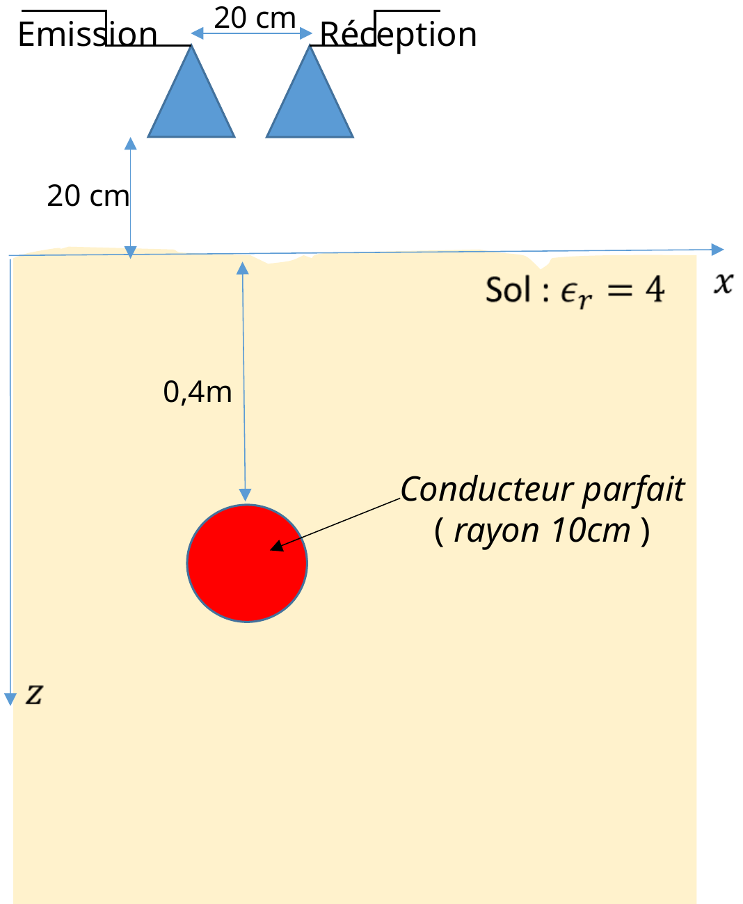{fig-alt="Antennes d'émission et de réception espacées de 20 cm, à 20 cm au-dessus d'un sol (εr = 4) ; conducteur parfait de rayon 10 cm enfoui à 0,4 m."}
:::

::: {.column width="62%"}
::: box-green
**A scan** : cylindre conducteur, mesures de $H(f)$ pour $f \in [\,0{,}5\ \text{GHz},\ 3\ \text{GHz}\,]$, $\Delta f = 20$ MHz, A scan normalisé par rapport à son maximum
:::

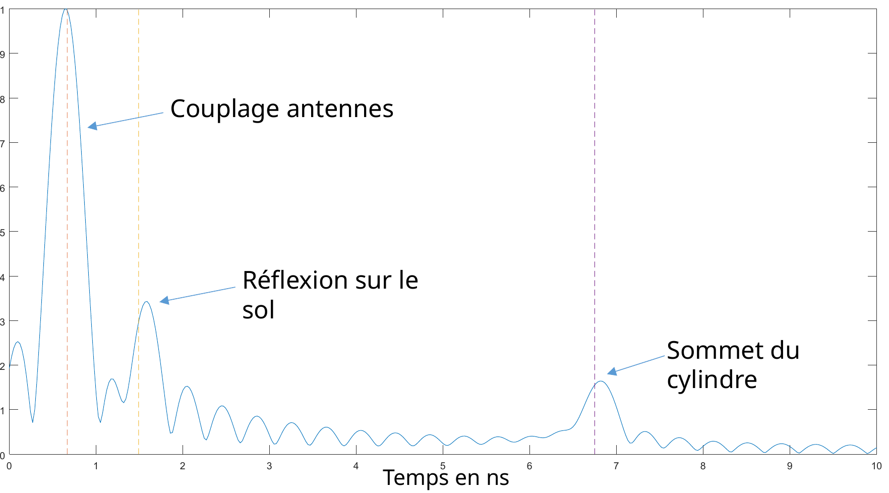{fig-alt="A scan normalisé en fonction du temps (0 à 10 ns) : pic de couplage entre antennes vers 0,7 ns, réflexion sur le sol vers 1,6 ns, sommet du cylindre vers 6,8 ns."}

::: box-green
**Remarque :** problème des lobes secondaires (couplage entre antennes et réflexion sur le sol), masquage potentiel d'objets enfouis
:::
:::
:::

## Radar pour l'auscultation de structures de génie civil

::: box-blue
**A scan : Exemple de masquage**
:::

::: columns
::: {.column width="38%"}
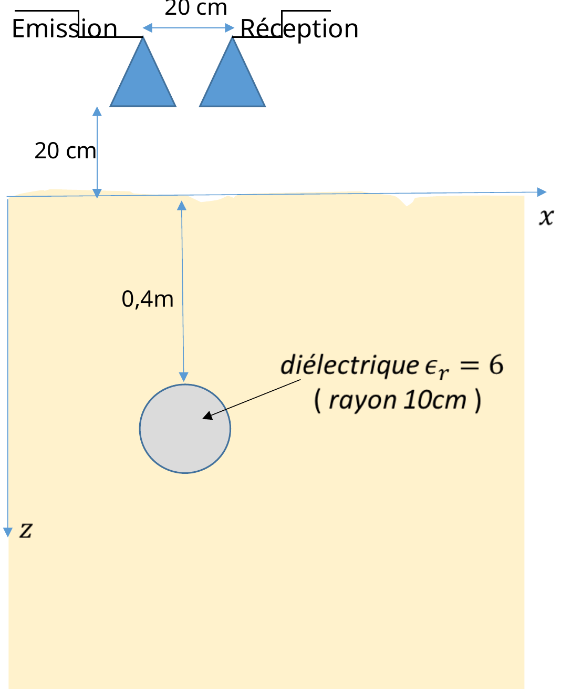{fig-alt="Même configuration avec un cylindre diélectrique (εr = 6, rayon 10 cm) enfoui à 0,4 m dans un sol εr = 4."}
:::

::: {.column width="62%"}
::: box-green
**A scan** : cylindre diélectrique, mesures de $H(f)$ pour $f \in [0{,}5\ \text{GHz},\ 3\ \text{GHz}]$, $\Delta f = 20$ MHz, A scan normalisé par rapport à son maximum
:::

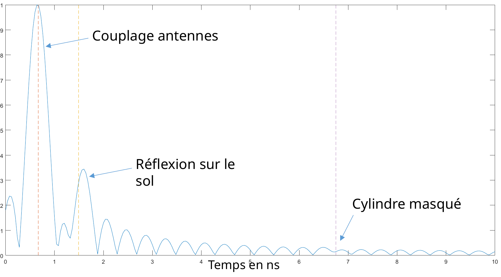{fig-alt="A scan normalisé : couplage entre antennes et réflexion sur le sol visibles, mais le cylindre diélectrique est masqué."}
:::
:::

## Radar pour l'auscultation de structures de génie civil

::: columns
::: {.column width="70%"}
::: box-blue
**B scan (1/3) : collection de A scan obtenus en déplaçant les antennes**
:::
:::

::: {.column width="30%"}
::: box-green
**Condition sur le pas :** $\Delta x < \lambda_{min}/4$
:::
:::
:::

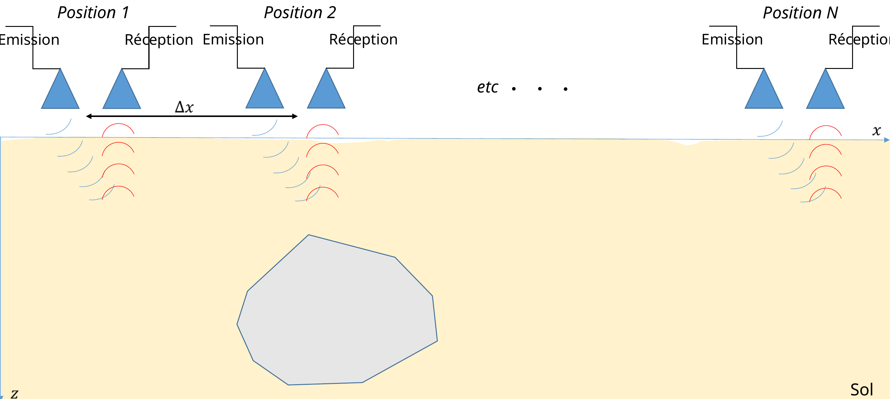{fig-align="center" width="95%" fig-alt="Les antennes émission/réception sont déplacées de la position 1 à la position N avec un pas Δx au-dessus du sol, qui contient un objet enfoui."}

## Radar pour l'auscultation de structures de génie civil

::: box-blue
**B scan (2/3) : Exemple avec gprMax**
:::

::: columns
::: {.column width="35%"}
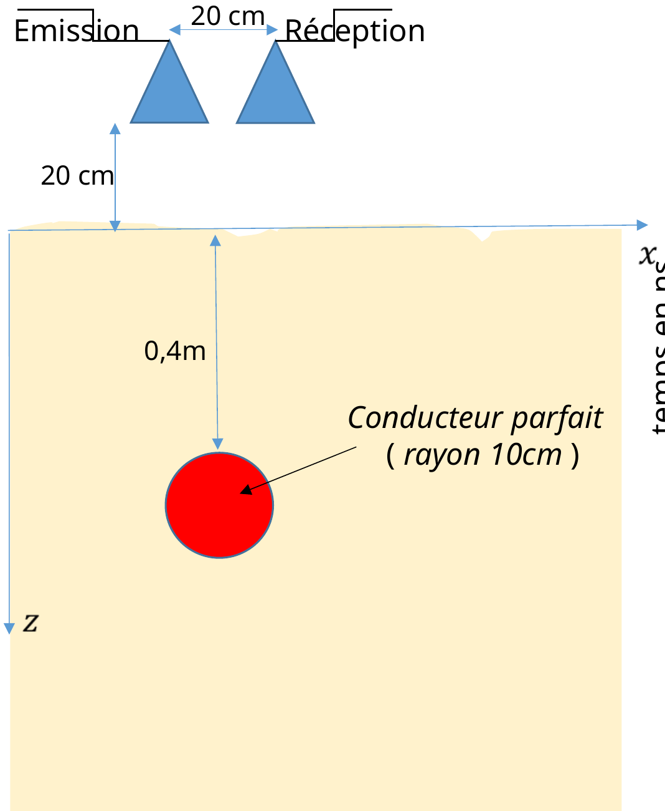{fig-alt="Configuration : antennes espacées de 20 cm à 20 cm du sol, conducteur parfait de rayon 10 cm à 0,4 m."}
:::

::: {.column width="65%"}
::: box-green
**B scan** : mesures de $H(f)$ pour $f \in [0{,}5\ \text{GHz},\ 3\ \text{GHz}]$\
Position initiale des antennes : 0,5 m — Position finale : 4,5 m\
Pas : 2 cm, $\Delta f = 20$ MHz
:::

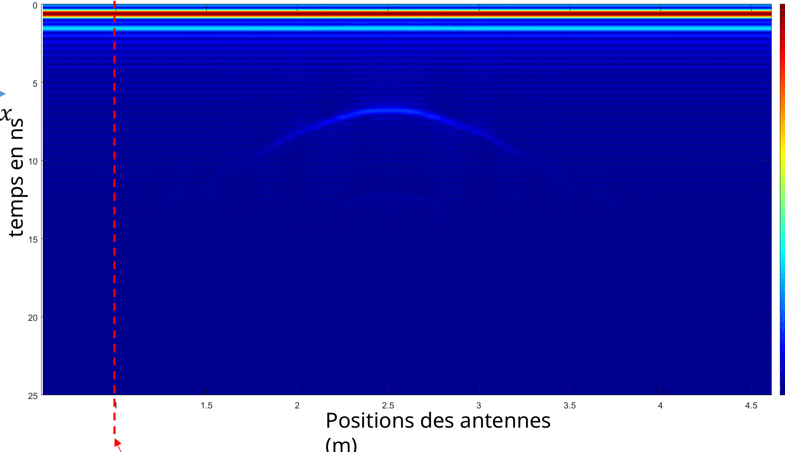{ width="80%" fig-alt="B scan en échelle linéaire (temps en ns en fonction de la position des antennes en m) : hyperbole caractéristique du cylindre vers 2,5 m."}
:::
:::

## Radar pour l'auscultation de structures de génie civil

::: box-blue
**B scan (3/3) : même image en dB**
:::

::: columns
::: {.column width="35%"}
{fig-alt="Même configuration que précédemment."}
:::

::: {.column width="65%"}
::: box-green
**B scan en dB** : mesures de $H(f)$ pour $f \in [0{,}5\ \text{GHz},\ 3\ \text{GHz}]$\
Position initiale des antennes : 0,5 m — Position finale : 4,5 m\
Pas : 2 cm, $\Delta f = 20$ MHz
:::

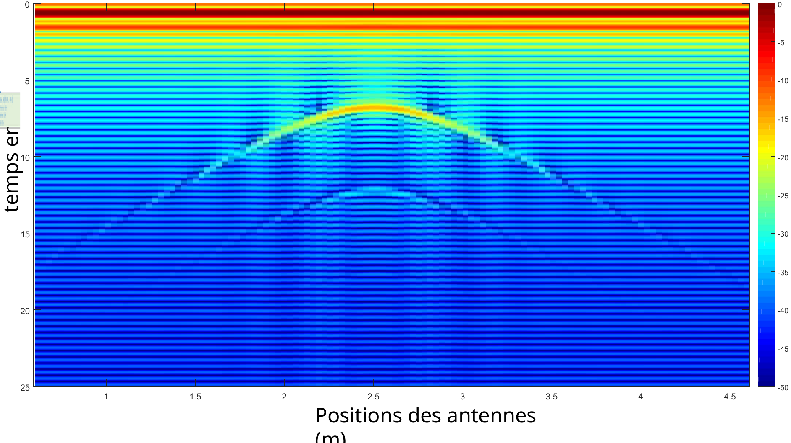{width="70%" fig-align="center" fig-alt="B scan en dB : hyperbole du cylindre, multiples échos et fortes bandes horizontales dues au couplage et à la réflexion sur le sol."}

::: box-green
**Problème :** artefacts dus au couplage et à la réflexion sur le sol
:::
:::
:::

## Radar pour l'auscultation de structures de génie civil

::: box-blue
**Imagerie : algorithme *Back Projection***
:::

::: columns
::: {.column width="40%"}
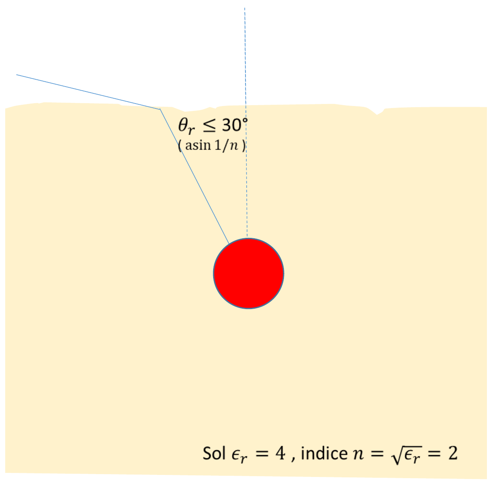{fig-alt="Réfraction dans le sol : θr ≤ 30° (asin 1/n), sol εr = 4, indice n = √εr = 2."}
:::

::: {.column width="60%"}

::: box-green
**Angle limite 30° dans le sol** ($\varepsilon_r = 4$)
:::

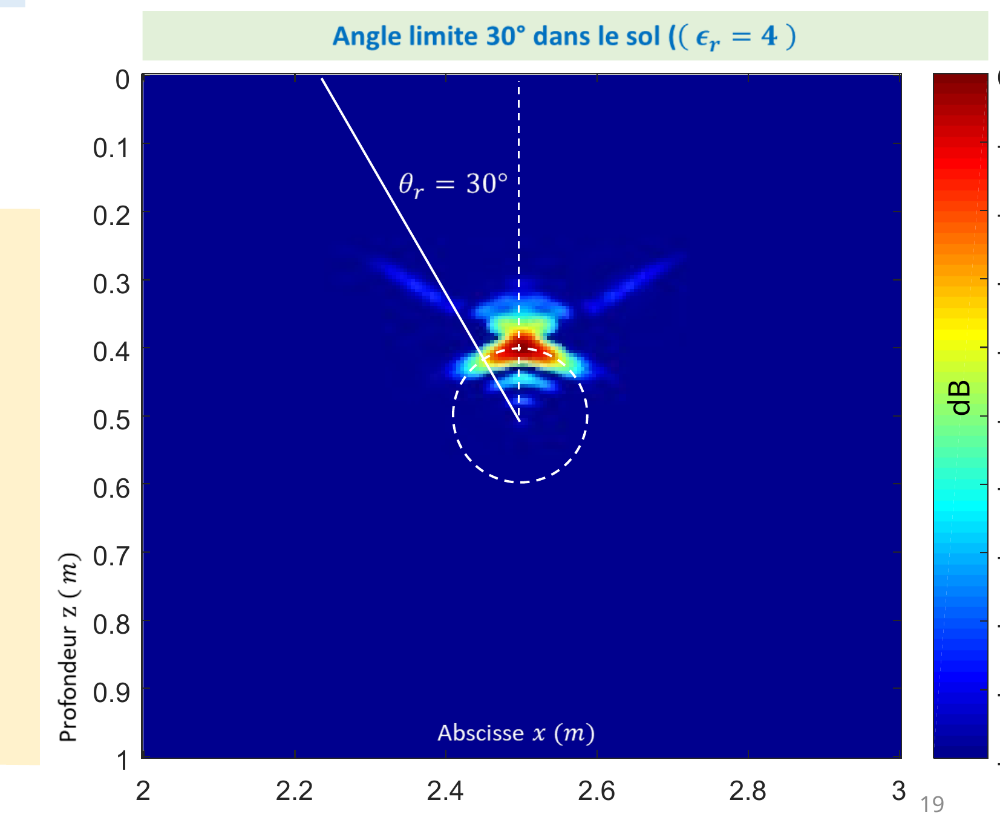{width="70%" fig-align="center" fig-alt="Image Back Projection en dB avec l'angle limite θr = 30° tracé depuis le centre du cylindre."}
:::
:::

# Démarche expérimentale

## Introduction

La mise en place du banc expérimental nécessite de tester **séparément chaque sous-système** avant une vraie campagne GPR.

C'est la manière la plus sûre d'identifier où se trouvent les erreurs :

**VNA → câbles → antennes → positionneurs → ensemble complet**

## Objectif {.smaller}

L'objectif n'est pas d'abord de « voir la cible », mais de vérifier que la chaîne de mesure est :

- **fonctionnelle** — chaque élément répond et opère dans sa plage nominale (fréquence, puissance, débattement mécanique)
- **stable** — la mesure ne dérive pas dans le temps (échauffement, bruit, connectique)
- **répétable** — une mesure refaite dans les mêmes conditions donne le même résultat
- **géométriquement cohérente** — les positions et orientations réelles correspondent à celles supposées par le modèle de mesure

## Démarche générale

Une progression **incrémentale**, sous-système par sous-système :

1. VNA seul
2. Câbles et connecteurs
3. Positionneurs
4. Antennes séparées
5. Paire bistatique (TX-RX)

## Objectifs de la séquence M1 {.smaller}

::: {.columns}
::: {.column width="55%"}
**5 semaines pour :**

- Découvrir le cadre et le contexte du projet **banc GPR**
- Prendre en main le **VNA** (analyseur de réseau vectoriel)
- Mener une **première campagne de mesure** 
- Caractériser les **cordons RF**
- Aborder la **mesure d'impédance** et la **programmation** du VNA
:::

::: {.column width="45%"}
 
**Fonctionnement**

- Compte rendu **hebdomadaire**
- Réunion **hebdomadaire** en distanciel
- Bilan **mensuel** en présentiel
:::
:::

## Planning général

| Semaine | Thème | Réunion |
|:-:|:--|:--|
| **1** | Accueil à l'ENS | Ven. 16 oct., 14 h |
| **2** | Campagne de mesure 1 : VNA | Ven. 23 oct., 15 h |
| **3** | Sensibilité des S~ii~ et cordons RF | Ven. 30 oct., 14 h |
| **4** | Mesure d'impédance, programmation du VNA | **Lun. 9 nov.**, 10 h |
| **5** | Bilan de la séquence ENS | **Jeu. 12 nov.**, 10 h (présentiel) |

::: {.callout-note}
Attention : la réunion de la semaine 4 a lieu un **lundi**.
:::

# Semaine 1 {background-color="#1f3a5f"}
Accueil à l'ENS

## Mardi 13 octobre

::: {.columns}
::: {.column width="40%"}
### 9 h 30
Accueil par **Éric** dans le hall de l'ENS
:::

::: {.column width="60%"}
### 14 h 00 – Distanciel
Présentation générale des missions :

- Cadre et contexte
- **Mission majeure : banc GPR**
- Missions annexes
- Gestion des commandes…
:::
:::

::: {.notes}
Contact Éric : 06 88 88 93 13.
Lien visio : https://bbb.fdn.fr/rooms/tut-6co-f6f-duq/join
:::

## Les missions

::: {.columns}
::: {.column width="50%"}
### Mission majeure

**Banc GPR** (*Ground Penetrating Radar*)

Banc expérimental de radar à pénétration de sol, instrumenté autour du VNA.
:::

::: {.column width="50%"}
### Missions annexes

1. **Impédance basse fréquence**
   - estimation de la permittivité
   - application au **béton**
2. **Mesure RF de la permittivité**
   - développement d'une **sonde**
:::
:::

## Mercredi 14 – Jeudi 15 octobre

- Installation du poste de mesure
- Prise en main du **VNA**
- Premières mesures

::: {.callout-tip}
Plan détaillé : répertoire **TODO** (à venir).
:::

## Vendredi 16 octobre

- **Matin** : préparation de la réunion hebdomadaire
  (template dans `reports_M1/template`)
- **Après-midi, 14 h – 15 h** : réunion hebdomadaire en distanciel

::: {.callout-important}
## Livrable
Rapport déposé dans `reports_M1` **une heure avant la réunion** (13 h).
:::

# Semaine 2 {background-color="#1f3a5f"}
Campagne de mesure 1 : VNA

## Campagne de mesure 1 : VNA

1. Mesure de la **puissance maximale** du port 1 en fonction de la fréquence
2. Mesure de la **sensibilité** en fonction de la fréquence, pour différentes **FI**
3. Calcul de la **dynamique**
4. **Comparaison** avec les spécifications constructeur

**Livrables :** compte rendu hebdomadaire
 
- réunion **vendredi 23 octobre, 15 h**

::: {.notes}
Dynamique = écart entre la puissance maximale et le plancher de bruit, à une FI donnée.
Rappeler l'effet de la largeur de bande FI sur le plancher de bruit.
:::

# Semaine 3 {background-color="#1f3a5f"}
Sensibilité des S~ii~ et cordons RF

## Sensibilité des S~ii~ et cordons RF

1. **Sensibilité sur les S~ii~** – comparaison avec la documentation
2. **Caractérisation des deux cordons RF :**
   - pertes d'insertion
   - ROS
   - stabilité de la phase
   - dérive en température

**Livrables :** compte rendu hebdomadaire 

-réunion **vendredi 30 octobre, 14 h**

# Semaine 4 {background-color="#1f3a5f"}
Mesure d'impédance et programmation

## Mesure d'impédance et programmation du VNA

1. Prendre connaissance de la **mesure d'impédance**
2. Prendre en main la **programmation du VNA** (à partir d'un exemple)

**Livrables :** compte rendu hebdomadaire 

- réunion **lundi 9 novembre, 10 h**

# Semaine 5 {background-color="#1f3a5f"}
Bilan de la séquence ENS

## Bilan de la séquence

- Rédaction d'un **rapport mensuel** sur les activités réalisées
- **Réunion mensuelle** avec l'équipe :
  - **jeudi 12 novembre, 10 h 00**
  - **en présentiel**, IUT de Ville d'Avray

## Calendrier des rendez-vous {.smaller}

| Date | Heure | Format | Objet |
|:--|:-:|:-:|:--|
| Mar. 13 oct. | 9 h 30 | Présentiel | Accueil à l'ENS |
| Mar. 13 oct. | 14 h | Visio | Présentation des missions |
| Ven. 16 oct. | 14 h | Visio | Réunion hebdo n°1 |
| Ven. 23 oct. | 15 h | Visio | Réunion hebdo n°2 |
| Ven. 30 oct. | 14 h | Visio | Réunion hebdo n°3 |
| Lun. 9 nov. | 10 h | Visio | Réunion hebdo n°4 |
| Jeu. 12 nov. | 10 h | Présentiel | Réunion mensuelle (IUT Ville d'Avray) |

# Missions secondaires

## Radar pour l'auscultation de structures de génie civil

::: box-blue
**Mesures de réflectométrie RF par sonde à effet de bout**
:::

::: columns
::: {.column width="58%"}
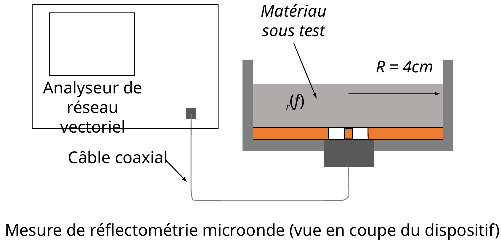{fig-alt="Schéma de la mesure de réflectométrie microonde (vue en coupe) : analyseur de réseau vectoriel relié par câble coaxial à la sonde ; matériau sous test de permittivité εr(f), rayon R = 4 cm."}

::: box-orange
**Modèle inverse de sonde coaxiale :**

$$\varepsilon_r^{*} = \frac{c_1 S_{11} - c_2}{c_3 - S_{11}}$$
:::
:::

::: {.column width="42%"}
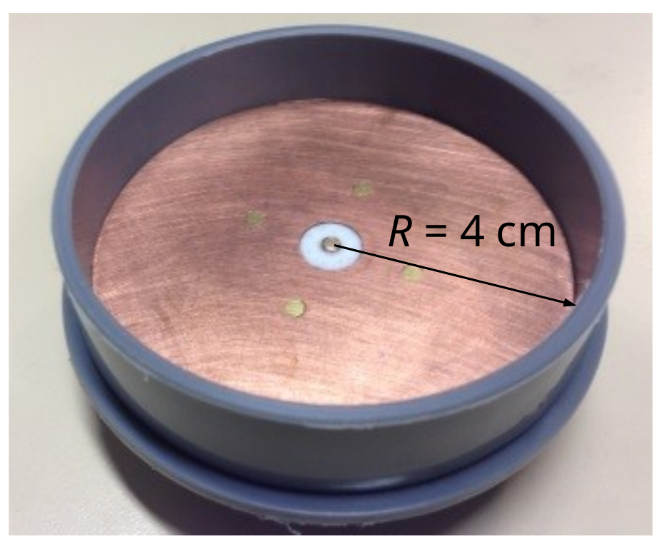{width="60%" fig-alt="Photo de la sonde à effet de bout dans son support cylindrique de rayon 4 cm."}

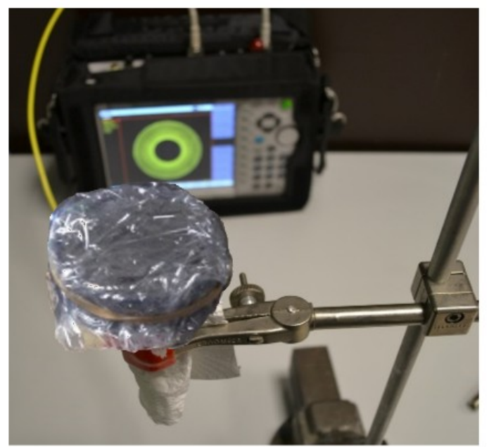{width="30%" fig-align="center" fig-alt="Photo d'un échantillon placé sur la sonde, relié à un analyseur portable."}
:::
:::

## Radar pour l'auscultation de structures de génie civil

::: box-blue
**Mesures de réflectométrie RF par sonde à effet de bout géante**
:::

 

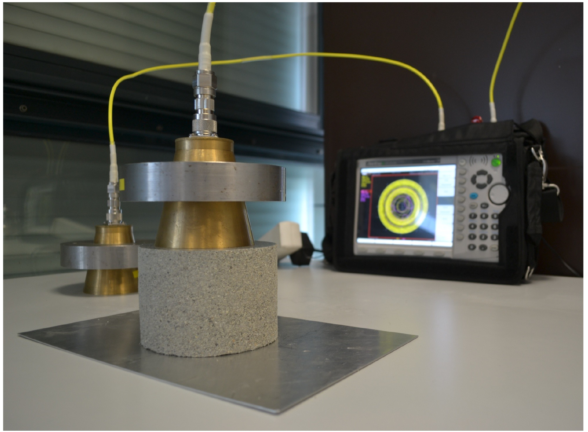{fig-align="center" width="70%" fig-alt="Photo de deux sondes à effet de bout géantes en laiton, dont une posée sur un échantillon cylindrique de béton sur une plaque métallique, reliées par câbles à un analyseur portable."}

## Radar pour l'auscultation de structures de génie civil

::: box-blue
**Mesures basses fréquence : cellule 4 points pour mesure d'impédance**
:::

::: columns
::: {.column width="55%"}
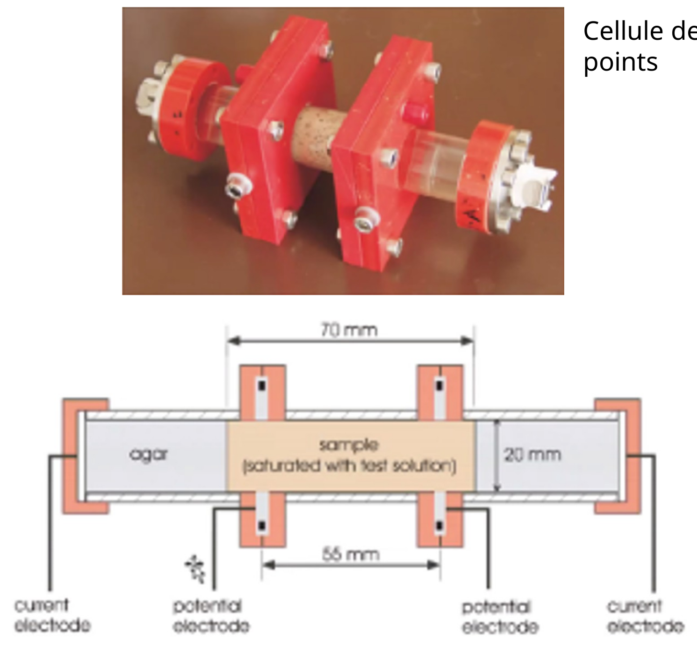{width="70%" fig-alt="Photo de la cellule de mesure 4 points et schéma en coupe : échantillon entre deux blocs d'agar, électrodes de courant aux extrémités et électrodes de potentiel, distances de 70 mm et 55 mm, diamètre 20 mm."}
:::

::: {.column width="45%"}
 
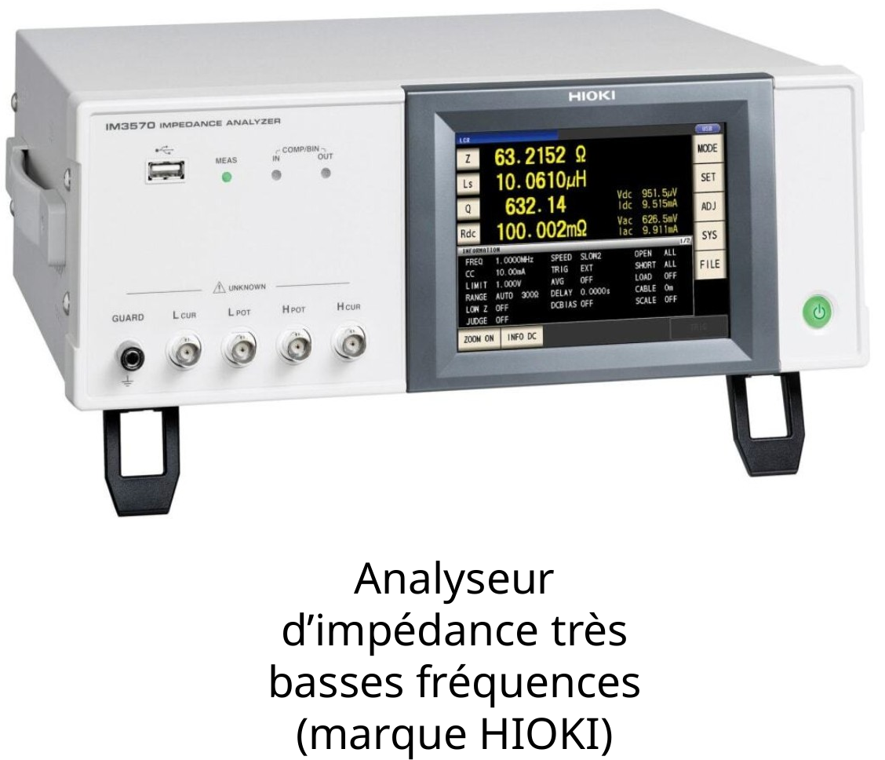{fig-alt="Analyseur d'impédance HIOKI IM3570."}
:::
:::

## Radar pour l'auscultation de structures de génie civil

 

::: box-blue
**Mesures basses fréquence : dispositif 4 points à électrodes ECG pour mesure d'impédance**
:::

 

::: columns
::: {.column width="45%"}
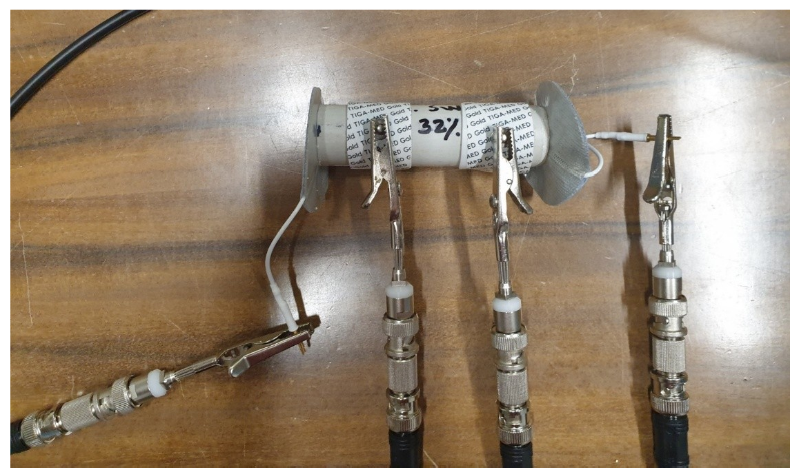{fig-alt="Dispositif de mesure 4 points sur un échantillon cylindrique avec pinces crocodile."}

:::

::: {.column width="30%"}
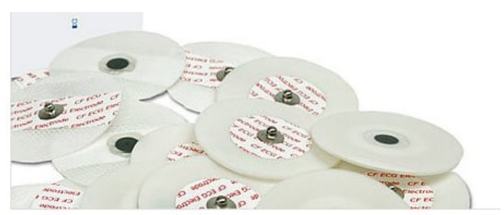{fig-alt="Électrodes ECG."}
:::

::: {.column width="25%"}
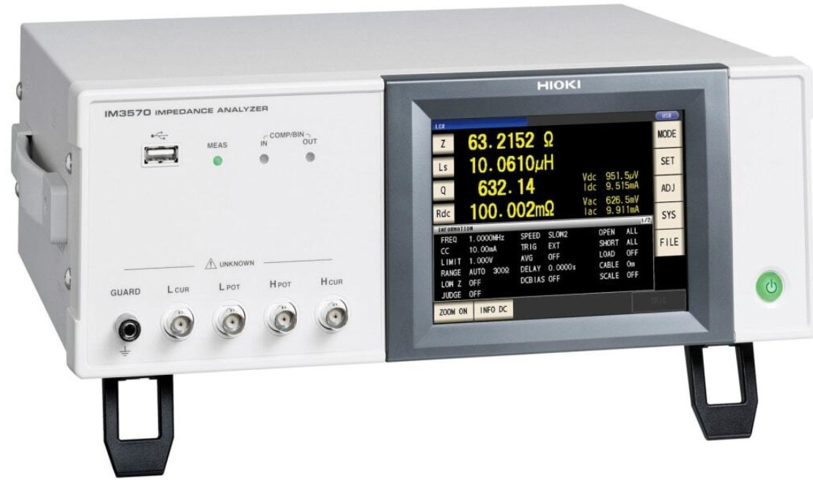{fig-alt="Analyseur d'impédance HIOKI IM3570."}
:::
:::
